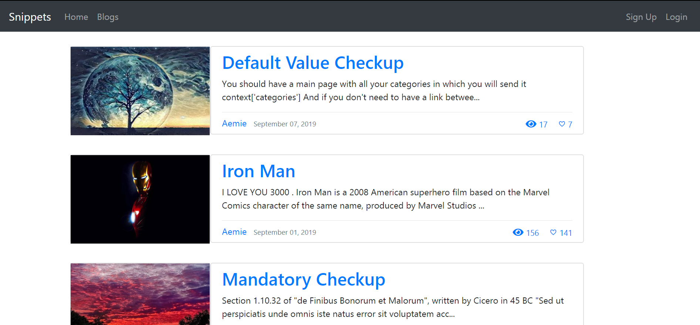

# Web Developmment

> Newbie to Django  
## Insight to Project

The project was primirarly focused on developing a website and able to learn the server-side interaction using Django as the backend framework . The front-end of the website was accomplished using bootstrap only . Apart from this , for making the website responsive jQuery was used and AJAX request using jQuery was implemented to communicate on the sever-side . 

Bootstrap is an open source toolkit for developing with HTML, CSS, and JS and quickly prototype the ideas with Sass variables and mixins , responsive grid system and powerful plugins built on jQuery. 

Django is a Python-based free and open-source web framework, which follows the model-template-view architectural pattern.

## Running on your local system 

1. Clone the repositry on your local system.
    ```
    git clone 'https://github.com/AemieJ/webDev.git'
    ```
2. Move into your directory by using the ```cd webDev``` command.
3. To start running the website on your system , use the following command and use localhost:8000 to be directed to the     website on your browser.
    ```
    python manage.py runserver
    ```
4. To make yourself the admin of the website , use the following command and in ```localhost:8000/admin``` you'll be        given the access to the database by logging in.
    ```
    python manage.py createsuperuser
    ```


## Built With

* [Django](https://www.djangoproject.com/)
* [Bootstrap](https://getbootstrap.com/)
* [jQuery](https://jquery.com/)

## Contributing

1. Fork it (<https://github.com/AemieJ/webDev/fork>)
2. Create your feature branch
3. Commit your changes
4. Push to the branch
5. Create a new Pull Request

## Showcase 


## Authors

* **Aemie Jariwala** - *Initial work* - [AemieJ](https://github.com/AemieJ)